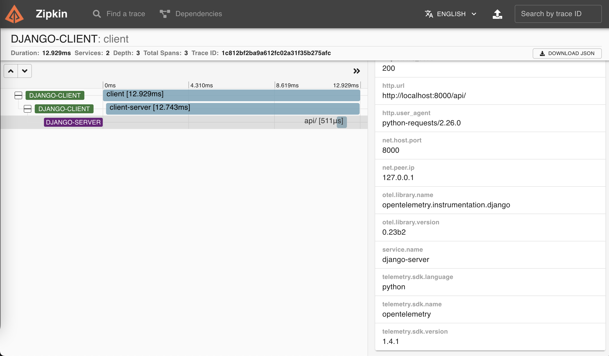

# Django Trace Context

Simple client and django server to show how OpenTelemetry and trace context work.

## Prerequisites

- Python 3.9

- Pipenv

- Docker

## Running the project

To install dependencies, run:

```bash
pipenv install
```

To run zipkin, type the command bellow:

```bash
docker run -p 9411:9411 openzipkin/zipkin
```

First, active this project's virtualenv:

```bash
pipenv shell
```

Inside [otel_django_app](./otel_django_app) type the following command to run the `server`:

```bash
python3 manage.py runserver --noreload
```

Open another terminal tab and activate the project's virtualenv again:

```bash
pipenv shell
```

Inside [otel_django_app](./otel_django_app) type the following command to run the `client`:

```bash
python3 client.py
```

to run zipkin, type the following command:

```bash
docker run -p 9411:9411 openzipkin/zipkin
```

to open zipkin dashboard, type the following command:

```bash
http://localhost:9411
```

the `api` run on port 8000:

```bash
http://127.0.0.1:8000/api/
```

at home page, let the search field empty and type `RUN QUERY` to load all traces. Finally, click in your trace, then you'll see a diagram like this:


